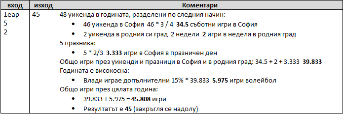
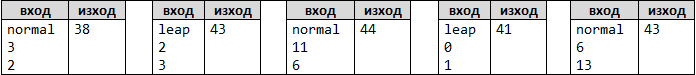

# Волейбол
Влади е студент, живее в София и си ходи от време на време до родния град. Той е много запален по волейбола, но е зает през работните дни и играе волейбол само през уикендите и в празничните дни. Влади играе в София всяка събота, когато не е на работа и не си пътува до родния град, както и в 2/3 от празничните дни. Той пътува до родния си град h пъти в годината, където играе волейбол със старите си приятели в неделя. Влади не е на работа 3/4 от уикендите, в които е в София. Отделно, през високосните години Влади играе с 15% повече волейбол от нормалното. Приемаме, че годината има точно 48 уикенда, подходящи за волейбол.
 
 Напишете програма, която изчислява колко пъти Влади е играл волейбол през годината. Закръглете резултата надолу до най-близкото цяло число (например 2.15  2; 9.95  9).
 Входните данни се въвеждат от потребителя като аргументи, в следния вид:
 
 ⦁	Първият аргумент(ред) е думата “leap” (високосна година) или “normal” (невисокосна).
 ⦁	Вторият аргумент(ред) е цялото число p – брой празници в годината (които не са събота и неделя).
 ⦁	Третият аргумент(ред) е цялото число h – брой уикенди, в които Влади си пътува до родния град.
 
 
<b>Примерен вход и изход:</b>
 

 
 

